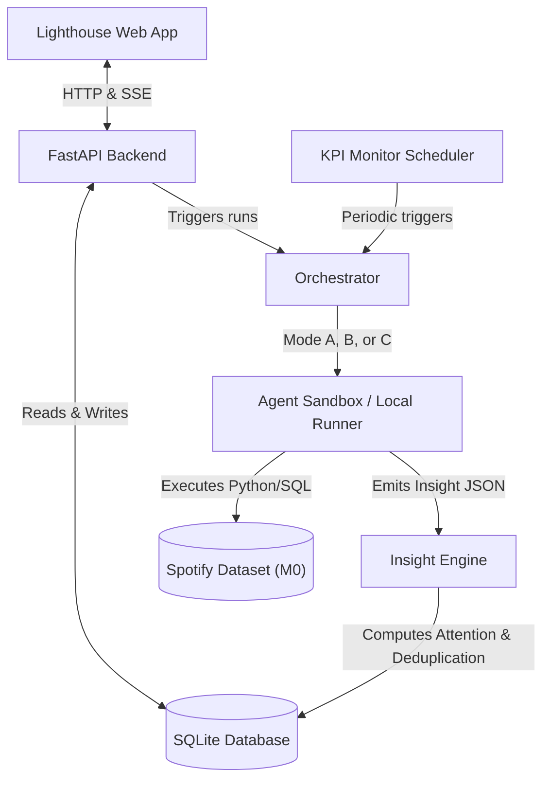

# Watsons: an army of automated Product Analysts Implementation Plan

This plan outlines the architecture, data structures, and step-by-step phases to build **Watsons** (codename Lighthouse), an army of automated Product Analysts that orchestrates Gemini Managed Agents (or local execution scripts) over our baked Spotify dataset to surface a ranked feed of actionable business insights.

## System Architecture & Data Flow

---

## Component Specifications

### 1. Control Plane & Orchestrator (`backend/orchestrator.py`)
Handles execution modes as defined in the spec:
* **Mode A (Single Analysis):** Executes a single skill (e.g., `cohort-retention-curves`) with parameterized configurations on the Spotify dataset.
* **Mode B (Group Run via Snapshot Pattern):** Loads relevant tables into memory or a single session (or a DB view), then runs multiple skills in parallel with clean conversational states, aggregating their results.
* **Mode C (Continuous KPI Monitoring):** Performs scheduled anomaly detection checks (daily or hourly) on headline KPIs, generating alerts only on significant anomalies.

### 2. Insight Engine (`backend/insight_engine.py`)
Parses, filters, scores, and clusters findings emitted by skills:
* **Attention Score Calculation:**
  $$\text{attention} = w_1 \cdot \text{magnitude\_norm} + w_2 \cdot \text{confidence} + w_3 \cdot \text{business\_impact\_norm} + w_4 \cdot \text{novelty} + w_5 \cdot \text{actionability} - w_6 \cdot \text{staleness}$$
* **Clustering & Deduplication:** Computes TF-IDF/embeddings similarity on title + summary + segment to group correlated insights (e.g., cascading funnel drops) under a single parent card.
* **Feedback Loop:** Exposes feedback actions (`useful`, `not-useful`, `acted-on`) that automatically adjust weights over time.

### 3. Data Models (`backend/models.py`)
SQLite database entities using SQLAlchemy:
* `AnalysisDefinition`: Name, description, group, skill kebab-case ID, and configuration parameters.
* `Run`: Type (single/group), status (pending, running, completed, failed), cost, output artifacts, and timestamp.
* `Insight`: Full JSON schema matching §9.1, attention score, cluster/grouping key, and feedback flags.
* `KPIDefinition`: Metric name, baseline definition, thresholds, schedule, and alert status.

### 4. Live PM Web App (`frontend/`)
A highly responsive, modern dashboard built with React, Vite, and Tailwind CSS:
* **Insight Feed:** Highly readable, sorted stream of prioritized insight cards with integrated interactive charts (using Recharts) and download controls.
* **Catalog Browser:** Interactive cards for all 13 analysis categories from `[automated-product-analyst-spec.md](automated-product-analyst-spec.md)`, allowing single or group executions.
* **KPI Monitor:** Real-time visual cards for active headline metrics with colored status alerts (green, warning, critical).
* **Live Run View:** Streamed logs/steps of the Orchestrator via Server-Sent Events (SSE).

---

## Phased Implementation Roadmap

### Phase 1: Core Backend & Data Connectors
* Setup FastAPI project directory structure with SQLite database models.
* Implement `[backend/insight_engine.py](backend/insight_engine.py)` for scoring, deduplication, and clustering.
* Create standard connector wrapper for the local Spotify parquet dataset (`data/catalog/` and `data/play_events/`).

### Phase 2: Orchestration & Group Runs
* Create `[backend/orchestrator.py](backend/orchestrator.py)` to manage runs.
* Implement the Mode B "data-snapshot" pattern using in-memory DuckDB views over the partitions to speed up parallel execution.
* Build local agent execution loops that parse the `AGENTS.md` house style and run `.agents/skills/*.md` using local python execution (or mock Gemini Interactions API).

### Phase 3: Anomaly Detection & Monitoring
* Implement the KPI Scheduler and the `anomaly-detection-kpi` routine.
* Connect SQL/DuckDB aggregation queries to automatically calculate daily/weekly baselines, alert thresholds, and standard deviations.

### Phase 4: PM Web Dashboard
* Construct the Vite + Tailwind React application.
* Build the priority-sorted Insight Feed, the live-streamed SSE run viewer, and the interactive charts/tables interface.
